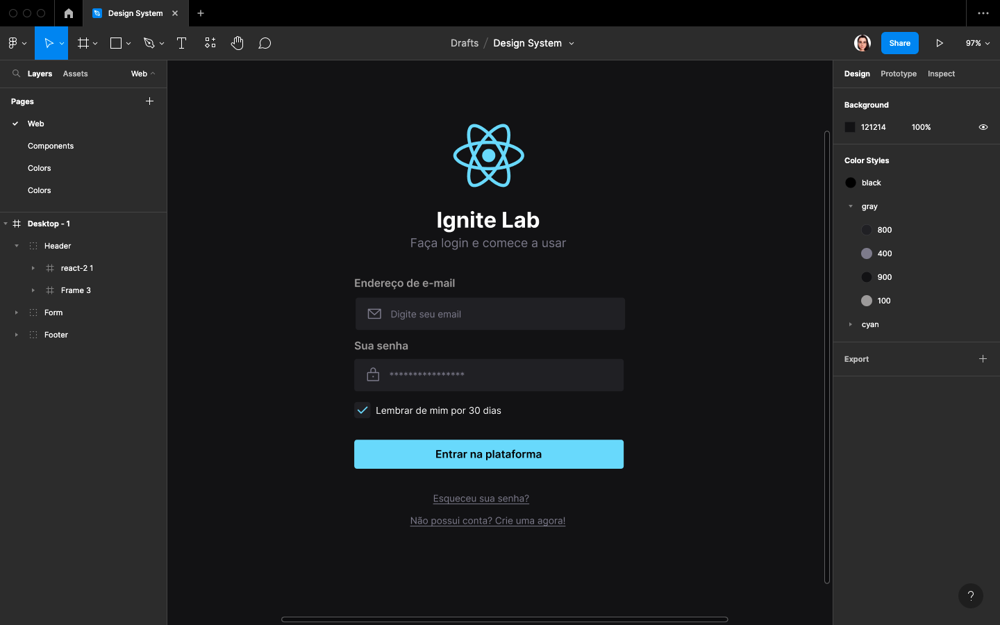
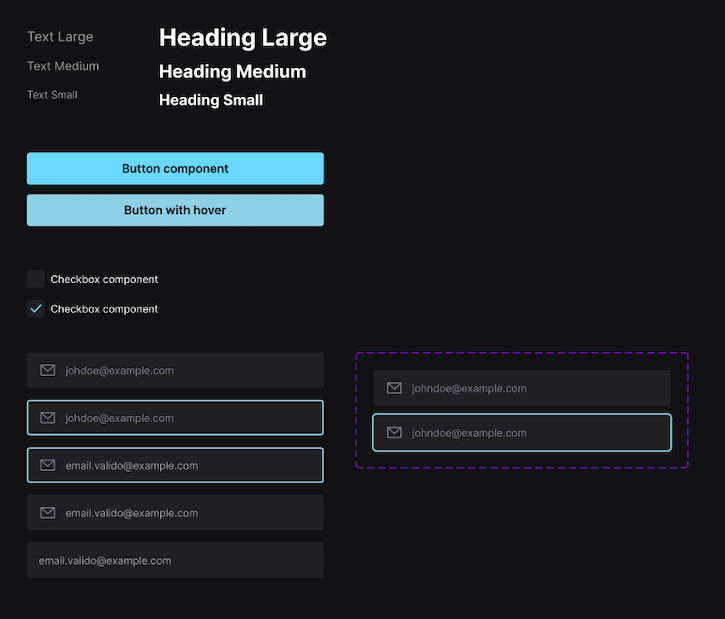
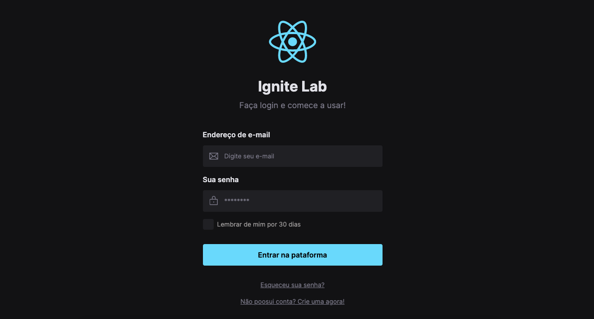

# Do Figma ao React

### Projeto realizado duranto o evento IgniteLab da Rocketseat entre os dias 11 a 14 de outubro.

### Sobre o desenvolvimento

#### Construção do protótipo no Figma

#### Construção dos tokens

#### Construção da aplicação em React
* Tailwind
* Typescript
* Radix (Slot)

#### Documentação em Storybook
[Deploy da Documentação](https://patriciapadilha.github.io/Design-System-storybook/?path=/story/components-button--default)
